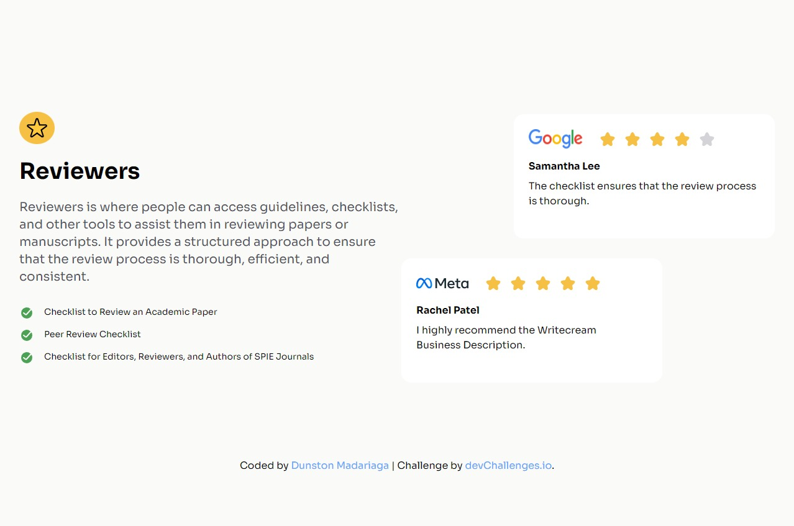

<!-- Please update value in the {}  -->

<h1 align="center">Testimonial Page | devChallenges</h1>

   Solution for a challenge <a href="https://devchallenges.io/challenge/testimonial-page" target="_blank">Testimonial Page</a> from <a href="http://devchallenges.io" target="_blank">devChallenges.io</a>.

  <h3>
    <a href="https://devchallenge-testimonialpage.netlify.app">
      Demo
    </a>
     | 
    <a href="https://devchallenge-testimonialpage.netlify.app">
      Solution
    </a>
     | 
    <a href="https://devchallenges.io/challenge/testimonial-page">
      Challenge
    </a>
  </h3>

<!-- TABLE OF CONTENTS -->

## Table of Contents

- [Overview](#overview)
  - [What I learned](#what-i-learned)
  - [Useful resources](#useful-resources)
- [Built with](#built-with)
- [Features](#features)
- [Author](#Author)

<!-- OVERVIEW -->

## Overview

### What I learned

With this challenge I have been able to practice very well the media queries, the flexbox and grid. I used grid to make the google and meta testimonial cards. It was an interesting challenge since I had to see how to put a testimonial card on top of another one but a little bit moved to one side. For a first time I don't feel I did it wrong, there are probably better ways to do it.

### Useful resources

[Bento Box Design](https://alphaefficiency.com/bento-box-design)

### Built with

<!-- This section should list any major frameworks that you built your project using. Here are a few examples.-->

- Semantic HTML5 markup
- [Tailwind](https://tailwindcss.com/)
- Flexbox
- CSS Grid

## Features

This application/site was created as a submission to a [DevChallenges](https://devchallenges.io/challenges-dashboard) challenge.

## Author

- Website [Testimonial Page](https://devchallenge-testimonialpage.netlify.app)
- GitHub [Pogo182028](https://github.com/Pogo182028)
